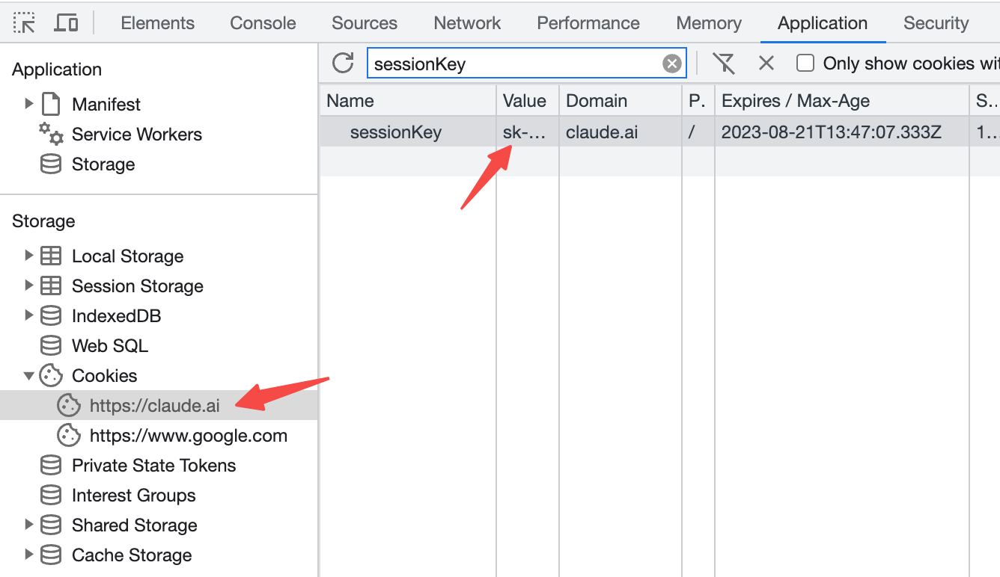
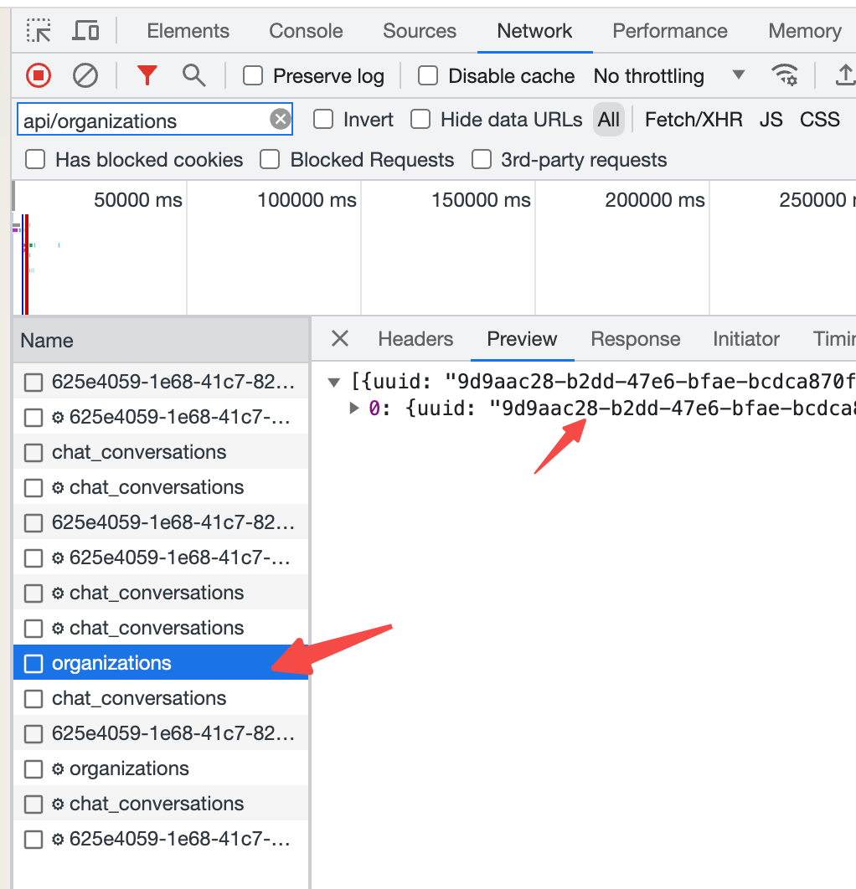

# claude-webapi

claude webapi sdk writen by golang.

support the latest claude-2 model.

## Preparation

- Your sessionKey

you should login into the [Claude Website](https://claude.ai) firstly, find the Cookie named `sessionKey`, and copy it's value.



- Your orgid

you can find your `orgid` in the Network panel.



## Quick Start

1. install claude-webapi sdk

```shell
go get -u github.com/all-in-aigc/claude-webapi
```

2. a quick demo for chatting with claude webapi

```go
package main

import (
	"log"

	claude "github.com/all-in-aigc/claude-webapi"
)

// custom params
var (
	baseUri    string = "https://claude.ai" // you can use a proxy address
	orgid      string = "xxx"               // your organazation id for claude account
	sessionKey string = "xxx"               // your session key after login claude.ai
	userAgent  string = "xxx"               // your request User-Agent
	debug      bool   = true                // if output request info
)

// new claude-webapi client
func getClient() *claude.Client {
	cli := claude.NewClient(
		claude.WithBaseUri(baseUri),
		claude.WithSessionKey(sessionKey),
		claude.WithOrgid(orgid),
		claude.WithUserAgent(userAgent),
		claude.WithDebug(debug),
	)

	return cli
}

func main() {
	cli := getClient()

	// chat with question
	text := "say hello to me 3 times"
	conversationId := "xxx" // your conversation id after new conversation

	params := map[string]interface{}{
		"attachments": []map[string]interface{}{},
		"completion": map[string]interface{}{
			"incremental": true,
			"model":       cli.GetModel(), // default model is "claude-2"
			"prompt":      "",
			"timezone":    "Asia/Shanghai", // your custom timezone
		},
		"organization_uuid": cli.GetOrgid(),
		"conversation_uuid": conversationId,
		"text":              text,
	}

	res, err := cli.GetChatStream(params)
	if err != nil {
		log.Fatalf("chat with prompt failed: %v", err)
	}

	reply := ""
	for v := range res.Stream {
		log.Printf("chat stream: %s\n", v.String())
		if v.Get("stop_reason").String() == "stop_sequence" {
			break
		}
		reply += v.Get("completion").String()
	}

	log.Println("reply:", reply)
}
```

## Other use cases

- Get Organizations

```go
cli := getClient()

res, err := cli.GetOrganizations()

if err != nil {
	log.Fatalf("get orgs fail: %v\n", err)
}

for _, v := range res.Array() {
	orgid := v.Get("uuid").String()
	log.Printf("orgid: %s\n", orgid)
}
```

- New Conversation

```go
conversationId := uuid.New().String()
name := "my conversation"

cli := getClient()
params := map[string]interface{}{
	"name": name,
	"uuid": conversationId,
}

res, err := cli.NewConversation(params)
if err != nil {
	log.Fatalf("new conversation fail: %v\n", err)
}

conversationName := res.Get("name").String()
log.Printf("conversation name: %s\n", conversationName)
```

- Get Conversations

```go
cli := getClient()

res, err := cli.GetConversations()

if err != nil {
	log.Fatalf("get conversations fail: %v\n", err)
}

for _, v := range res.Array() {
	conversationId := v.Get("uuid").String()
	conversationName := v.Get("name").String()
	log.Printf("conversation: %s, %s\n", conversationId, conversationName)
}
```

- Chat With Attachments

```go
type ChatMessage struct {
	CreatedAt int64
	UserName  string
	Content   string
}

func getAttachment() ([]map[string]interface{}, error) {
	attachments := []map[string]interface{}{}

	msgs := []*ChatMessage{
		{1690041600, "sam", "hello"},
		{1690041605, "gpt-4", "hello my friend"},
		{1690041610, "claude", "hello boy"},
		{1690041618, "sam", "let's talk about something about llm"},
		{1690041622, "gpt-4", "sure, I'am intertesd in it"},
		{1690041625, "claude", "sounds funny"},
		{1690041631, "sam", "let's go head"},
	}

	content := "room chat messages with format: [time] user: content\n\n"
	for _, msg := range msgs {
		if msg.Content == "" {
			continue
		}

		t := time.Unix(msg.CreatedAt, 0)
		content += fmt.Sprintf("%s %s: %q\n", t.Format("2006-01-02 15:04:05"), msg.UserName, msg.Content)
	}

	if content == "" {
		return nil, errors.New("no content")
	}

	fileName := "chat_messages.txt"
	attachments = append(attachments, map[string]interface{}{
		"extracted_content": content,
		"file_name":         fileName,
		"file_size":         len(content),
		"file_type":         "text/plain",
	})

	return attachments, nil
}

func ChatWithAttachments() {
	text := `summary room chat messages in file, what're they talk about?`
	conversationId := "xxx"
	attachment, _ := getAttachment()

	cli := getClient()
	params := map[string]interface{}{
		"attachments": attachment,
		"completion": map[string]interface{}{
			"incremental": true,
			"model":       cli.GetModel(),
			"prompt":      text,
			"timezone":    "Asia/Shanghai",
		},
		"organization_uuid": cli.GetOrgid(),
		"conversation_uuid": conversationId,
		"text":              text,
	}

	res, err := cli.GetChatStream(params)

	if err != nil {
		log.Printf("get chat stream failed: %v\n", err)
	}

	reply := ""
	for v := range res.Stream {
		log.Printf("chat stream: %s\n", v.String())
		if v.Get("stop_reason").String() == "stop_sequence" {
			break
		}
		reply += v.Get("completion").String()
	}

	log.Println("reply:", reply)
}
```

## Tests

Test cases are under the `./examples` folder, you can test them by `go test`.

## Communication

- Telegram Group: [all in AIGC](https://t.me/+OtxKWYMf8UE0ZWQ1)

- Discord Server: [all in AIGC](https://discord.gg/qSrsTzuw)